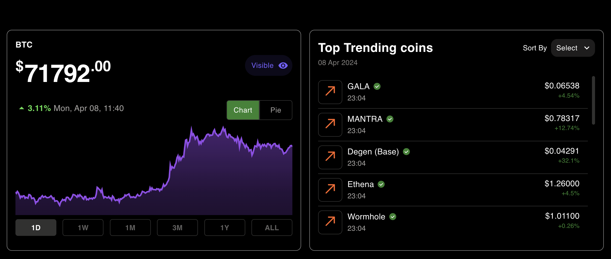
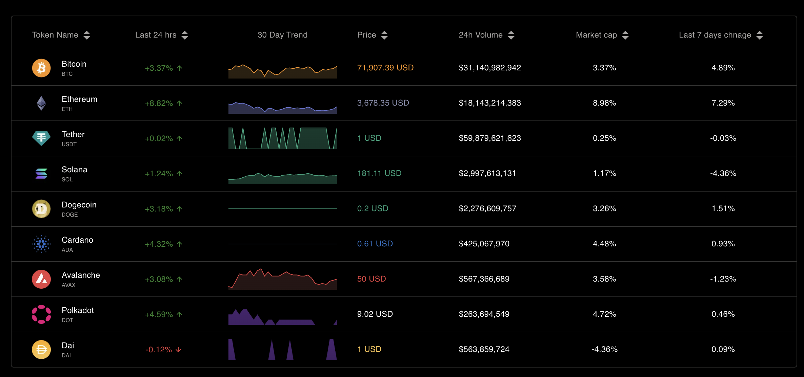
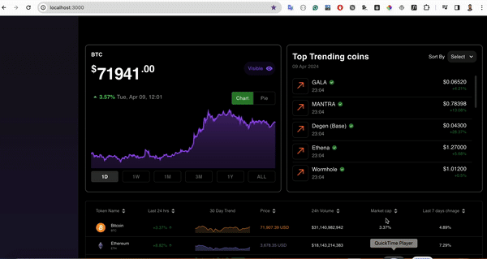

## Klink Practical Task
This is a demo project built with Next.js and Redis and CoinGecko API to populate the UI sections.

### Table of Contents
- [Introduction](#Introduction)
- [Features](#Features)
- [Installation](#Installation)
- [Usage](#Usage)

### Introduction
This project serves as information about crypto currencies and these data fetch from the CoinGecko API to show on different UI components. CoinGecko return Cache data frequently, So data store in our redis cache memory and load on local API call. Integrated dynamic Charts for specific interval data showing on chart.

- Node version is `v21.7.1`

### Features
**Next.js Integration**: The project is built using Next.js, a popular React framework for building server-rendered applications.

**Redis Caching**: Redis is used as a caching layer to store frequently accessed data, reducing database load and improving performance

**Chart.js Integration**: Dynamic and Custom chart for render coin's Up/Down price charts. Refer [Chart.js][1]

**Material-UI Styling**: Utilizes Material-UI for consistent and customizable UI components and styling. Refer [Material-UI][2]


### Installation
1. Set up Redis
 - Ensure Redis is installed and running on your local machine or on a remote server.
 - Redis connection details set in .env file
 
2. Clone the repository:
```bash
git clone https://github.com/mynkamipara/klink-practical.git && cd klink-practical
```
2. Install dependencies:
```bash
npm install
```
3. `.env.local` setup ( Ref .env.example )
	either `.env.development` for development or `.env.production` for production
```bash
NEXT_PUBLIC_APP_NAME = klink practical
NEXT_PUBLIC_APP_URL = http://localhost:3000
COINGECKO_API_URL = https://api.coingecko.com/api/v3
REDIS_HOST=127.0.0.1
REDIS_PORT=6379
```

### Usage

1. Start the development server:
```bash
npm run dev
```
2. Open your browser and visit http://localhost:3000 to view the application.

### Main page
> http://localhost:3000

### Facing Issues
 - Some time getting error of CoinGecko api call to reached limit, So just wait and refresh page again so it will get infromation whatever api response is not store in cache memory.
   
### Information
 - Chart API cache update on every 30, 1800, 43200 sec
 - Coin List API cache update on every 45 sec
 - Price API cache update on every 60 sec
 - top trending API cache update on every 600 sec


### Screenshots




[1]: https://react-chartjs-2.js.org/
[2]: https://next.mui.com/material-ui/getting-started/